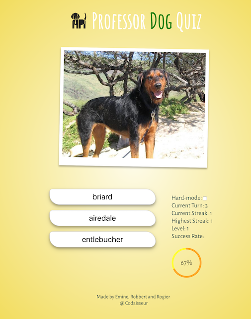
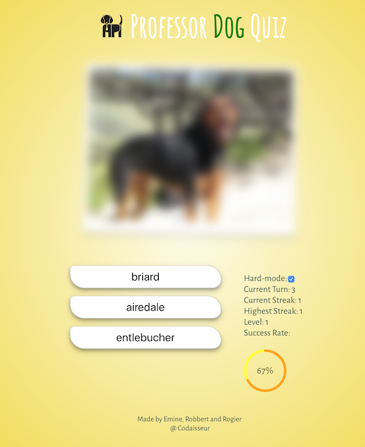
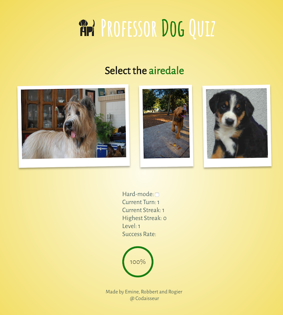
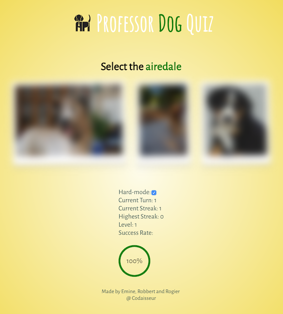

[](https://app.netlify.com/sites/professor-dog-quiz/deploys)

# Professor Dog Quiz
### [Check out the deployed version here!](https://professor-dog-quiz.netlify.com/)

Picture questions with 3 dog breeds as answer. Easy and hard-mode side-by-side:<br/>
 
<br/>

Breed questions with 3 dog images as answer. Easy and hard-mode side-by-side:<br/>



## Table of contents
- **[What this project is about](#what-this-project-is-about)**
- **[Technologies used](#technologies-used)**
- **[Game Rules](#game-rules)**
- **[Run Locally](#run-locally)**
- **[Our agile workflow and Trello board](#our-agile-workflow-and-trello-board)**
- **[Contributors](#contributors)**

## What this project is about
This quiz will test your dog breed knowledge. It will start easy but when the game progresses, more breeds will be introduced and the type of questions will differ. Let's see if you can make it to level 10! Your quiz stats are updated each time you select the right or wrong answer.

## Technologies used
For this project we only used `React`, `Redux` and `Redux-Thunk`.

## Game Rules
The webapp shows the user a random picture of a dog (based on the Dog API). The user is asked to choose the correct breed name from a list of 3 options. When the user makes a choice, they proceed to the next question.
Occasionally the user will get a different question type. The game shows them the name of a breed and 3 images of dogs. The user must select the correct image that matches the breed name.
If the user makes the wrong choice, the game should shows them the right answer, then pause for 2 seconds before proceeding to the next question.
The game must keep track of the user's performance and display a success rate (in percentages) on the page.
The user can use the keyboard to select their answer for quicker gameplay by pressing 1, 2 or 3.
The game starts off with only 3 breeds and should gradually increase in difficulty. When the user has a streak of 10 correct answers, the game will add another 3 breeds into the mix, and so on.

## Run Locally
```sh
npm install
npm run start
```

## Our agile workflow and Trello board

We try to maintain a backlog to keep track of all implemented and future features. That way people can quickly jump in and start helping out. It also displays how we split up our tasks and try to build this project in an iterative and incremental way!

**[Check out our trelloboard here](https://trello.com/b/V5Ise7Ed/professor-dog-quiz)**

## Contributors

Development Team:<br />
Emine Bahçe Çizer: https://github.com/eminebahce<br />
Robert Hames Mann: https://github.com/MannRobertJ<br />
Rogier Verkaik: https://github.com/rogierv
Dusty Wood Saunders: https://github.com/dustywsaunders
